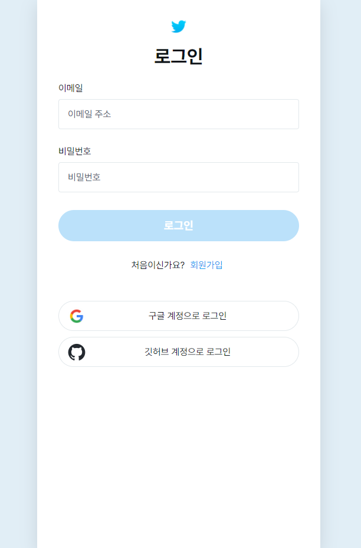
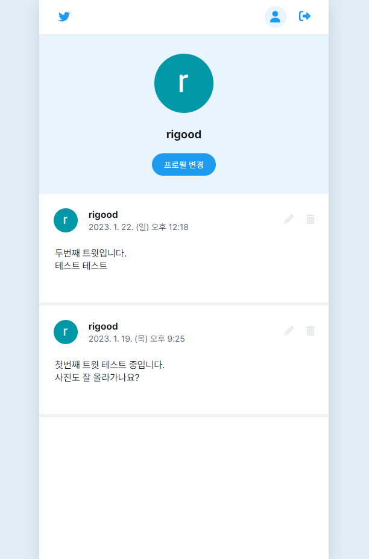

# ✖ Twitter

🚀 배포 링크: [Twitter 바로가기](https://rigood.github.io/twitter)

|               로그인               |             홈화면             |               프로필               |
| :--------------------------------: | :----------------------------: | :--------------------------------: |
|  |  |  |

 

## 프로젝트 소개

Firebase를 이용하여 사용자 인증, 기본적인 CRUD 및 이미지 업로드 기능을 구현한 트위터 앱입니다.

- [2023.10.29] 2차 수정
- [2023.01.15~19] 1차 수정
- [2022.10.11~12] 개발

 

## 사용 기술

- React
- firebase v9
- react-router-dom v5
- styled-components
- uuid

 

## 상세 설명

- `App.js`
  - Firebase Auth 상태 변화를 감지하여 로그인 여부(isLoggedIn), 사용자 객체(userObj), 사용자 객체 업데이트 함수(refreshUser)를 Router 컴포넌트에 props로 전달합니다.
  - 인증 정보를 불러오는 동안 로딩 이미지를 표시하였습니다.
- `Router.js`
  - 로그인이 되어있지 않으면 Auth 페이지를 라우팅합니다.
  - 로그인이 되어있는 경우, "/" 경로에는 Home 페이지를, "/profile" 경로에는 Profile 페이지를 라우팅합니다. 프로필 화면에 사용자 정보를 반영하기 위해 Profile 페이지에 refreshUser 함수를 전달하였습니다.
- `Auth.js`
  - isLoginPage 상태값에 따라 로그인 또는 회원가입 페이지를 렌더링합니다.
  - 입력값이 변할 때마다 이메일, 비밀번호 유효성 검사를 실시하고, 유효한 경우에만 submit 버튼이 활성화됩니다.
  - 로그인에는 signInWithEmailAndPassword, 회원가입에는 createUserWithEmailAndPassword 메서드를 사용하였습니다.
  - 소셜 로그인은 해당 SNS provider를 signInWithPopup 메서드에 전달하면 됩니다.
  - try-catch 문으로 에러를 처리하고, 사용자에게 에러메시지를 표시하였습니다.
- `Home.js`
  - Firebase DB에서 전체 트윗 목록을 가져와 화면에 렌더링합니다. orderBy를 통해 최신순으로 정렬하고, onSnapshot를 사용하여 실시간으로 업데이트된 목록을 가져옵니다.
  - 트윗은 최대 120자까지 작성할 수 있으며, 1자 이상 입력해야 Tweet 버튼이 활성화됩니다.
  - 입력값에 따라 textarea의 높이가 자동조절되도록 구현하였습니다.
  - 이미지를 첨부하고, 첨부한 이미지를 삭제할 수 있습니다.
  - FileReader를 이용하여 이미지 미리보기를 구현하였고, Firebase Storage에 이미지를 업로드하였습니다. uuid4를 사용하여 이미지 파일에 랜덤 id를 부여하였습니다.
  - 이미지가 첨부된 경우 응답시간이 길어지므로, 트윗을 업로드 하는 동안 버튼 텍스트를 "Uploading..."으로 바꾸고 클릭하지 못하게 비활성화하였습니다.
  - 트윗 내용과 이미지를 수정하거나 트윗을 삭제할 수 있습니다. 트윗 삭제 시 이미지 파일도 Storage에서 삭제됩니다.
- `Profile.js`
  - 프로필 사진과 닉네임을 확인하고, 이를 변경할 수 있습니다.
  - 본인이 작성한 트윗 목록을 확인하고, 이를 수정하거나 삭제할 수 있습니다.
  - 로그아웃은 signOut 메서드로 구현하였으며, 로그아웃 된 후 로그인 화면으로 이동합니다.
